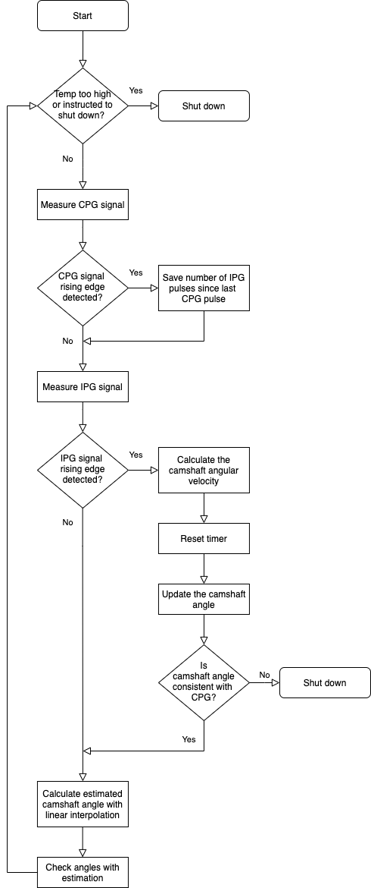

# DMT Biofuel Engine Control System

This is the repository for the software used for the DMT Biofuel Engine Sensors & Control Team. The Sensors & Control team are developing a control system that will allow a motorcycle engine to run on E85 fuel using an Arduino Micro to control the fuel injection and spark timings of the engine.

This is based off camshaft and crankshaft encoders from the engine to determine the precise angle of the shafts. By modelling the engine using 1D analysis, the optimal shaft angles for charging/discharging the ignition coils or opening/closing the fuel injectors can be found. When the shaft positions reach these optimal angles, the program will open or close the appropriate circuit controlling one of the ignition coils or fuel injectors.



## Pre-requisites

__For testing prerequisites, go to the readme within the relevant test folder.__

You must have an Arduino Micro and `arduino-cli` installed in order to upload the program to the microcontroller.

You can install `arduino-cli` from [here](https://www.arduino.cc/pro/cli). Also make sure you have installed the core libraries, which can be done using the following command:

```bash
arduino-cli core install arduino:samd
```

## Installation

This repository can be downloaded using:

```bash
git clone git@github.com:Loumstar/DMT-Control-System.git
```

Before uploading the program to the Arduino, ensure all the tests have passed to make sure it will function correctly.

To install the program onto the Micro, run the following command:

```bash
arduino-cli upload ...
```

## Usage

The arduino will start the program when powered on. Therefore, once the control has a power supply the program will run on its own. For the moment, the only way to power-off the Arduino is to remove the power supply.

Control through a computer and serial communication will be added shortly.

## Testing

This repository contains three tests.

### PCB Test

The PCB test is a test script that is run on the Arduino while it is housed in the PCB of the control system.

This test is necessary for checking all the transistors function as they should, by producing a a square wave for a particular injector or coil circuit, at a particular engine speed.

For more information, go to the readme within `pcb_test/`.

### Unit test

More information will be added shortly.

### Engine Simulation (integration) test

More information will be added shortly.

## Repository structure

```text
DMT-Control-System/
    readme.md                           
    tests/
        pcb_test/
            readme.md
            pcb_test.ino
            src/
                control_system/
                    control_system.h
                    control_system.c
                messages/
                    messages.h
                    messages.c
    bioengine/
        bioengine.ino
        src/
            control_system/
                control_system.h
                control_system.c 
            engine_map/
                engine_map.h
                engine_map.c


```

## Contact

If you need any information or help, please email me at [louis.manestar18@imperial.ac.uk](mailto:louis.manestar18@imperial.ac.uk).
