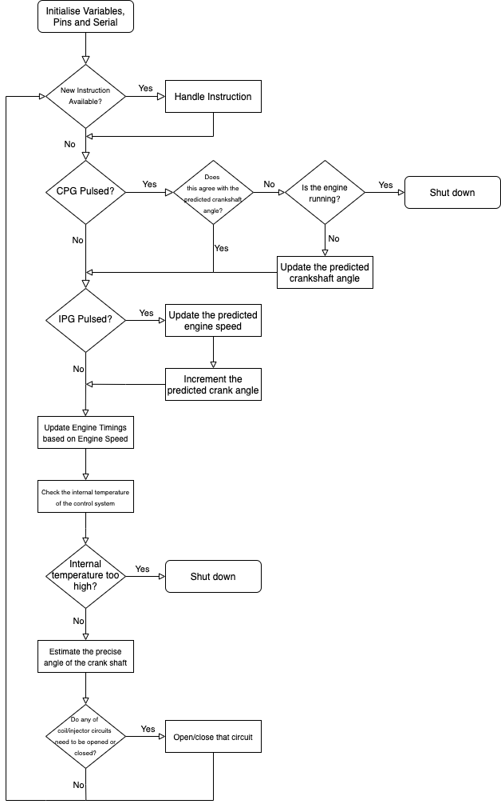

# DMT Biofuel Engine Control System

This is the repository for the software used for the DMT Biofuel Engine Sensors & Control Team. The Sensors & Control team are developing a control system that will allow a motorcycle engine to run on E85 fuel using an Arduino Micro to control the fuel injection and spark timings of the engine.

This is based off camshaft and crankshaft encoders from the engine to determine the precise angle of the shafts. By modelling the engine using 1D analysis, the optimal shaft angles for charging/discharging the ignition coils or opening/closing the fuel injectors can be found. When the shaft positions reach these optimal angles, the program will open or close the appropriate circuit controlling one of the ignition coils or fuel injectors.

__The software has not yet been fully refactored or commented.__ This will be completed in the next few weeks.



## Pre-requisites

__For testing prerequisites, go to the readme within the relevant test folder.__

In order to run this software, you must have:

- Arduino Micro.
- Arduino IDE.
- `arduino-cli` (optional).
- GitHub Desktop (optional).

You can install the Arduino IDE from [here](https://www.arduino.cc/en/software). Make sure you have the latest versions of all libraries, especially `SoftwareSerial`. These come as part of the IDE when it is first downloaded.

You can install `arduino-cli` from [here](https://www.arduino.cc/pro/cli) or use Homebrew:

```bash
brew install arduino-cli
```

Also make sure you have installed the latest core libraries, which can be done using the following commands:

```bash
arduino-cli core install arduino:avr
arduino-cli upgrade
```

You can download and install GitHub Desktop from [here](https://desktop.github.com/).

## Installation & Board Uploading

This repository can be downloaded using:

```bash
git clone git@github.com:Loumstar/DMT-Control-System.git
```

Alternatively, you can download this repository by clicking the __code__ button on the repository homepage and selecting either __Open with GitHub Desktop__ or __Download ZIP__.

Open `bioengine.ino` on the Arduino IDE. Connect your computer to the Arduino via USB. From the __Tools__ dropdown menu, set the board type to __Arduino Micro__ and select the relevant __Port__. The port is often selected automatically.

To upload the program to the arduino, click __Upload__ on the Arduino IDE. Alternatively, you can use `arduino-cli` for more information on the process.

Within `bioengine/` use the following commands:

```bash
arduino-cli compile bioengine -v --fqbn arduino:avr:micro
arduino-cli upload bioengine -v --port [PORT_NAME] --fqbn arduino:avr:micro
```

## Usage

When the program has been uploaded, Click on the __Serial Monitor__ from the __Tools__ dropdown menu. This will allow you to communicate and instruct the Arduino to open/close different circuits.

Set the baud rate to 9600 Bd. __Ensure that the Serial messages are sent with a newline at the end.__ This is how the Arduino knows a message is available. This can be selected from the dropdown menu at the bottom of the serial monitor.

The instructions passed to the Arduino have a bash-style syntax:

```bash
command [--RPM target_speed ]
```

There are four commands available:

- `START`, which starts the engine by allowing the control system to control the injector and ignition coil circuits.
- `STOP`, which shuts down the engine.
- `SET`, which allows you to configure parts of the control system. So far, only the target engine speed can be configured but this will be expanded soon.
- `STATUS`, which details information about the control system and its latest estimations of the timings, speed and temperature.

`--RPM` is a flag used with the `SET` command to select the target engine speed while the control system is running. 

The speed value is given in RPM, and will cause the circuit to pulse at the same rate as if the engine had that RPM.


## Testing

### PCB Test

The PCB test is a test script that is run on the Arduino while it is housed in the PCB of the control system.

This test is necessary for checking all the transistors function as they should, by producing a square wave for a particular injector or coil circuit, at a particular engine speed.

For more information, go to the readme within `pcb_test/` and refer to the PCB Test Specification in the Testing Report.

### Engine Simulation (integration) test

The engine simulator test is a script for modelling engine signals that are used in the control system. This is includes the CPG, IPG and the analog signal from the thermistor.

This test is used to determine the speed and resilience of the constrol system software when loaded onto the Arduino Micro.

For more information, go to the readme within `engine_simulator/` and refer to the Engine Simulator Test Specification in the Testing Report.

## Repository structure

```text
DMT-Control-System/
    readme.md  
    bioengine/
        bioengine.ino
        src/
            control_system/
                control_system.h
                control_system.c 
            engine_map/
                engine_map.h
                engine_map.c
            messages/
                messages.h
                messages.c
    tests/
        pcb_test/
            readme.md
            pcb_test.ino
            src/
                control_system/
                    control_system.h
                    control_system.c
                messages/
                    messages.h
                    messages.c
        engine_simulator/
            engine_simulator.ino
            src/
                messages/
                    messages.h
                    messages.c
```

Note some of these libraries are copied over to the test folders. This is due to a quirk of Arduino when compiling, where local libraries can only be found if they are in a `src/` folder within the Arduino sketch.

## Contact

If you need any information or help, please email me at [louis.manestar18@imperial.ac.uk](mailto:louis.manestar18@imperial.ac.uk).
