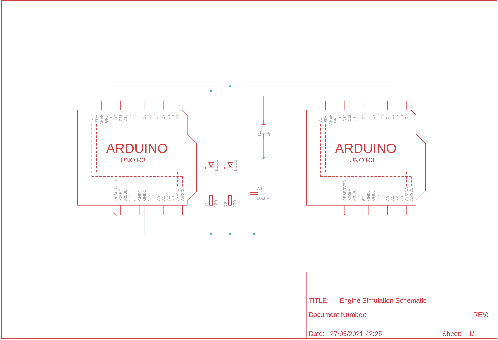

# DMT Biofuel Engine Simulator Script

This is a script for modelling the signals required for the DMT Biofuel Engine control system software. Due to the pandemic, it has not been possible to run the engine, so the best way to determine whether the software is able to accurately measure signals and control the engine is to model the signals using another Arduino.

Three signals are modelled:

- CAM Pulse Generator (CPG), which pulses when the piston in the first cylinder reaches TDC.
- Ignition Pulse Generator (IPG), which pulses every 30 degrees of rotation of the crankshaft.
- The internal temperature of the control system, which is a potential divider circuit with one resistor as a thermistor.

The analog voltage of the thermistor potential divider is created using a PWM which is filtered using a simple passive low-pass filter. The PWM duty cycle is calculated based on a polynomial approximation of the relationship between temperature and resistance of the thermistor.


The setup for the engine simulator and control system microcontroller is shown below. The left microcontroller is the engine simulator and the right microcontroller has the control system software uploaded onto it.



For more information about the testing process, read the __Test Specification__.

## Pre-requisites

In order to use this software, you must have:

- Arduino Micro.
- Arduino IDE.
- GitHub Desktop (optional).

To install the Arduino IDE, follow this [link](https://www.arduino.cc/en/software). The IDE provides an easy way to verify and upload the program to the board, as well as a serial monitor to communicate with the Arduino. 

GitHub Desktop also provides a quick way of downloading the repository, which can be installed from [here](https://desktop.github.com/).

## Installation & Board Uploading

Download this repository by clicking the __code__ button on the repository homepage and selecting either __Open with GitHub Desktop__ or __Download ZIP__.

Go to where the folder has been downloaded, and navigate to `engine_simulator/` and open `engine_simulator.ino` in the Arduino IDE.

Click on the __Tools__ dropdown menu and select the board type. for the PCB test this will be __Arduino Micro__. Once the Arduino has been plugged into your computer, check the __Port__ from the same menu. This should be done automatically, however if no board is found, you can select the Micro from the list of available devices.

Click __Upload__ to install the program on the Arduino. If the build fails please [email me](mailto:louis.manestar18@imperial.ac.uk).


## Usage

When the program has been uploaded, Click on the __Serial Monitor__ from the __Tools__ dropdown menu. This will allow you to communicate and instruct the Arduino to model different engine speeds and temperatures.

Set the baud rate to 9600 Bd. __Ensure that the Serial messages are sent with a newline at the end.__ This is how the Arduino knows a message is available. This can be selected from the dropdown menu at the bottom of the serial monitor.

The instructions passed to the Arduino have a bash-style syntax:

```bash
command [--TEMP temperature_value | --SPEED speed_value]
```

There are four commands available:

- `START`, which starts the pulses.
- `STOP`, which stops the pulses.
- `SET`, which allows you to set the target circuit to pulse and/or the speed at which it is pulsing.
- `STATUS`, which allows you to get information about what the script is simulating.

`--TEMP` and `--SPEED` are optional flags that allow you to configure the simulator parameters,

Note: All target names must be given in __uppercase__. You can select:

The speed value is given in RPM, and will cause the circuit to model the pulses at the same rate as if the engine had that RPM. The temperature value is given in degrees Celsius.

### Example Instructions

```bash
SET --TEMP 40 --SPEED 2300
```

This will cause the Arduino model the control system with an internal temperature of 40 deg C and the engine running at 2300 RPM.

```bash
STATUS
```

This will return information about what the engine simulator is modelling.

```bash
START
```

Start the signals. This will only have an effect if both the temperature and speed have been defined beforehand.

```bash
STOP
```

Stop the signals. You should call this before unplugging the Arduino to be safe.

```bash
SET --SPEED 4000
```

If the temperature has already been set, you can change the speed by omitting the `--TEMP` flag. The reverse is also possible if you wish to change the temperature, but want to keep the speed the same.

## Contact

If you need any information or help, please email me at [louis.manestar18@imperial.ac.uk](mailto:louis.manestar18@imperial.ac.uk).
